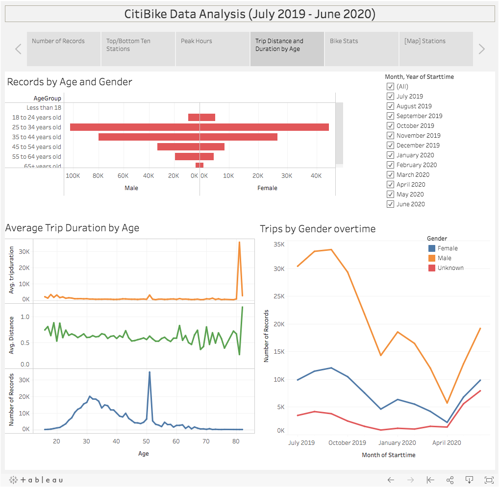

# Tableau Homework - Citi Bike Analytics

## Data Source
Monthly CSV files (July 2019- June 2020) were collected from [Citi Bike Data](https://www.citibikenyc.com/system-data) webpage.

## Visualizations
https://public.tableau.com/profile/jua.han#!/vizhome/citiBikes/Analysis?publish=yes

## Analysis

### 1. Number of Records
Total number of records were 12 billion. People seem to ride more bikes in the summer than in the winter. The possible reason could be that people are not willing to ride outside in winter due to the cold weather.
September 2019 had the lowest number of records, while April 2020 had the lowest number of records.

### 2. Top/Bottom Ten Stations
Top ten stations for both ending and starting a journey are Grove St PATH and Hamilton Park.

### 3. Peak Hours
Rush hours(8:00 and 17:00-18:00) seem to be the peak hours for riders.
In the summer, more people ride bikes in the evening than in the morning, but in the winter, more people ride bikes in the morning than in the evening.

### 4. Trip Distance and Duration by Age
If we look at the records by age, highest number of records (34,628) were recorded by people aged 51, although majority of the users are aged between 25-44 years old. 
In terms of the distance and duration, most young users rode citi bikes for short distance, while the older people rode for longer distance and duration.
It is clear that men ride way more citi bikes than women and unknown gender. Usage of three categories peaked during Summer, and then decreased after September.

### 5. Number of Bikes and Distance
Total number of bikes used in New York is 1,388, and their average distance ridden is 0.61 mile.
Bike with ID 29584 has the highest mileage (more than 450 miles), and is most likely due for repair or inspection.
Moreover, bikes are mostly ridden by the annual subscribers.

